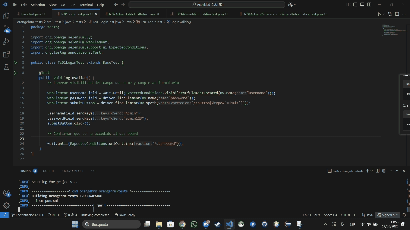
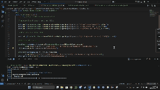
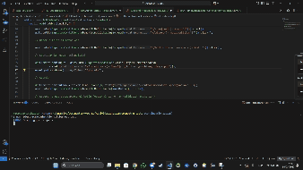
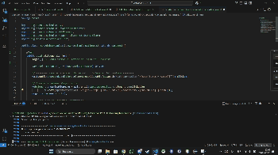
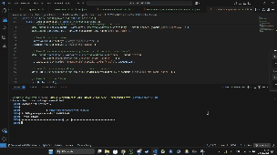
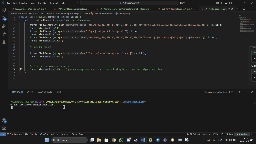
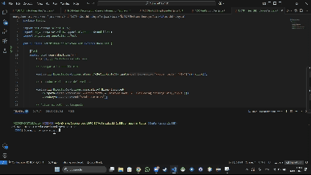
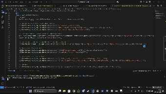
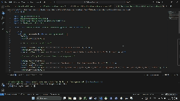
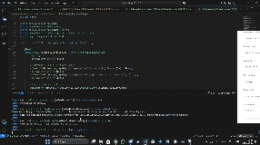

# Actividad12.2ED - Automatización de pruebas con Selenium y TestNG

Este proyecto ha sido desarrollado como parte de la asignatura **Entorno de Desarrollo** del ciclo formativo de **Desarrollo de Aplicaciones Web**. El objetivo principal es automatizar diez casos de prueba funcionales sobre el sistema OrangeHRM utilizando **Java**, **Selenium WebDriver**, **TestNG** y **Maven**.

## 📁 Estructura del proyecto

El proyecto está organizado con la estructura estándar de Maven. Dentro del paquete de pruebas, cada clase representa un caso de prueba independiente.

```
Actividad12.2ED/
├── pom.xml
├── testng.xml
└── src/
    └── test/
        └── java/
            └── com/
                └── orangehrm/
                    └── tests/
                        ├── TC1_LoginValidoTest.java
                        ├── TC2_AddJobTitleTest.java
                        ├── TC3_AddNationalityTest.java
                        ├── TC4_EditGeneralInfoTest.java
                        ├── TC5_AddEmployeeTest.java
                        ├── TC6_AddReportTest.java
                        ├── TC7_SearchEmployeeTest.java
                        ├── TC8_AssignLeaveTest.java
                        ├── TC9_LeaveControlTest.java
                        └── TC10_AssignSpecifivLeaveTest.java
```

## 🔧 Tecnologías empleadas

- **Java 17**
- **Apache Maven**
- **Selenium WebDriver**
- **TestNG**
- **Google Chrome + ChromeDriver**
- **Git + GitHub**

## ✅ Casos de prueba automatizados

Se han implementado los siguientes casos de prueba:

| Nº | Clase de prueba                  | Descripción funcional                             |
|----|----------------------------------|----------------------------------------------------|
| 1  | `TC1_LoginValidoTest`           | Validación de inicio de sesión con credenciales correctas |
| 2  | `TC2_AddJobTitleTest`           | Añadir un nuevo puesto de trabajo                 |
| 3  | `TC3_AddNationalityTest`        | Añadir una nueva nacionalidad                     |
| 4  | `TC4_EditGeneralInfoTest`       | Editar información general de la empresa          |
| 5  | `TC5_AddEmployeeTest`           | Añadir un nuevo empleado                          |
| 6  | `TC6_AddReportTest`             | Crear un nuevo informe personalizado              |
| 7  | `TC7_SearchEmployeeTest`        | Buscar un empleado por nombre                     |
| 8  | `TC8_AssignLeaveTest`           | Asignar un permiso a un empleado específico       |
| 9  | `TC9_LeaveControlTest`          | Verificar y revisar los permisos asignados        |
| 10 | `TC10_AssignSpecifivLeaveTest`  | Asignar un tipo de permiso específico             |

## Adjunto una imagen de la hoja de cálculo para el proyecto en bajo nivel con sus procesos explicados:


## ▶️ Ejecución de pruebas

### Desde terminal

1. Abre una terminal en la raíz del proyecto.
2. Ejecuta:

```bash
mvn test
```

Esto ejecutará todos los tests definidos en `testng.xml`.

### Desde IDE (Eclipse / IntelliJ)

1. Abre el proyecto como proyecto Maven.
2. Haz clic derecho en `testng.xml` > `Run as TestNG Suite`.

## 🛠️ Problemas encontrados y soluciones aplicadas

Durante el desarrollo se detectaron algunos errores comunes:

- **ElementNotInteractableException**: Solucionado usando `JavascriptExecutor` para realizar clics y esperas explícitas.
- **Cambios en el DOM**: Solucionado localizando elementos dinámicos con XPaths más robustos.
- **Errores de sincronización**: Resueltos con `WebDriverWait` y condiciones esperadas (`ExpectedConditions`).

## 📸 Evidencias visuales (GIFs)

A continuación se muestran los GIFs que demuestran la ejecución automática de los casos de prueba:

### TC1_LoginValidoTest  
📎 

### TC2_AddJobTitleTest  
📎 

### TC3_AddNationalityTest  
📎 

### TC4_EditGeneralInfoTest  
📎 

### TC5_AddEmployeeTest  
📎 

### TC6_AddReportTest  
📎 

### TC7_SearchEmployeeTest  
📎 

### TC8_AssignLeaveTest  
📎 

### TC9_LeaveControlTest  
📎 

### TC10_AssignSpecifivLeaveTest  
📎 

## 📌 Autor

**Víctor Manuel Ridao Chaves**  
Estudiante de 1º de DAW  
Asignatura: Entorno de Desarrollo  
Curso 2024-2025
