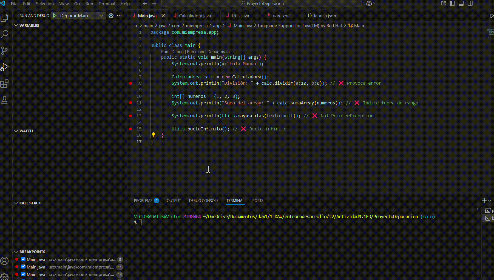
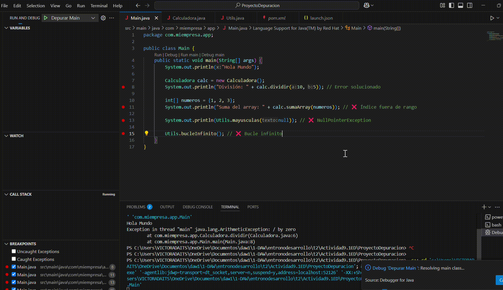
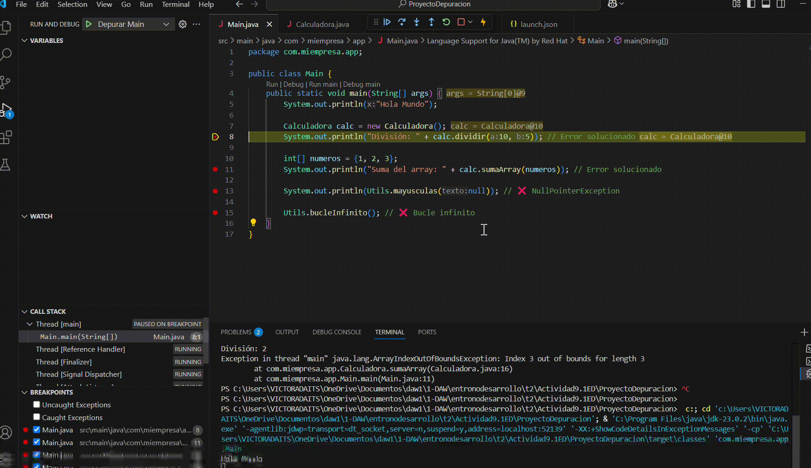
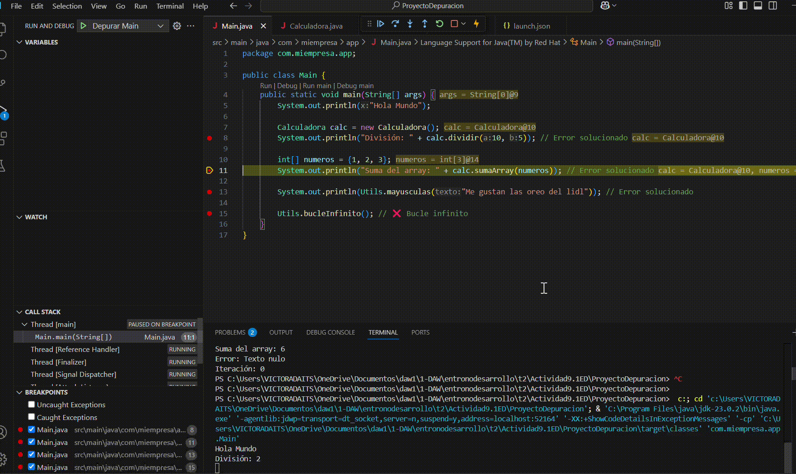
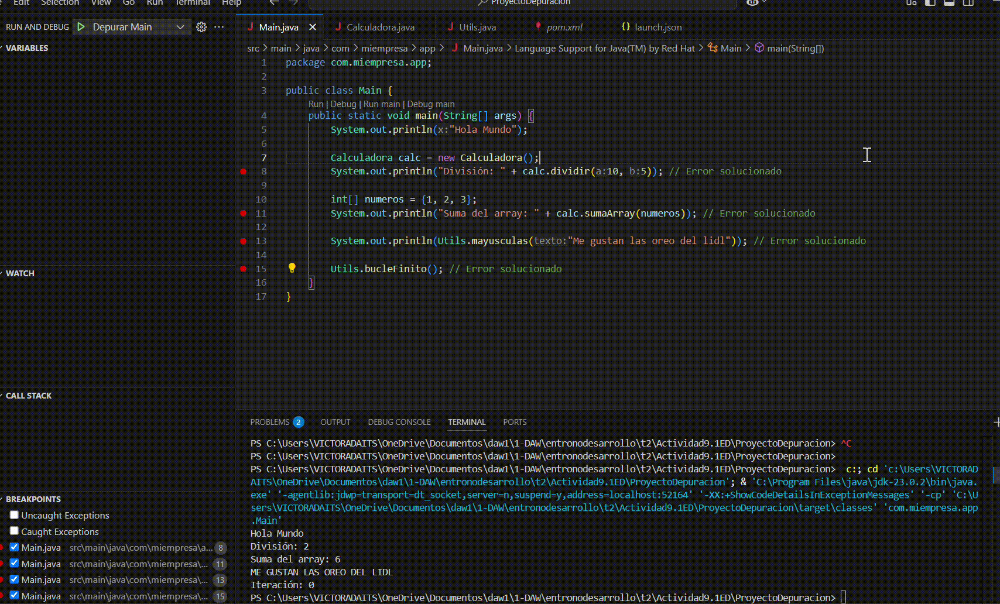

# Proyecto de Depuración en Java con Maven

## 📌 Descripción
Este es un proyecto desarrollado en **Java** utilizando **Maven** y **Visual Studio Code**, cuyo objetivo es practicar la depuración de código. Se han introducido errores intencionales en la aplicación para identificarlos y corregirlos mediante herramientas de depuración.

## 📂 Estructura del Proyecto
```
ProyectoDepuracion
├── src
│   ├── main
│   │   ├── java/com/miempresa/app
│   │   │   ├── Main.java
│   │   │   ├── Calculadora.java
│   │   │   ├── Utils.java
├── pom.xml
├── .vscode/launch.json
```

## 🚀 Instalación y Ejecución
### 🔧 Requisitos Previos
- Tener instalado **Java (JDK 23 o superior)**
- Tener instalado **Maven**
- Tener **Visual Studio Code** con las extensiones de Java

### 📥 Clonar el Repositorio
```sh
https://github.com/victormanuel-98/Actividad9.1ED.git
```

### ⚙️ Compilar y Ejecutar
```sh
mvn clean compile
mvn exec:java -Dexec.mainClass="com.miempresa.app.Main"
```

## 🔍 Errores Encontrados y Soluciones Aplicadas
Se han documentado los siguientes errores durante la depuración:

### 🛑 Error 1: [División errónea]
**GIF:**

**Solución Aplicada:** [Sustituimos el valor 'null' por 5]

### 🛑 Error 2: [Array erróneo]
**GIF:**

**Solución Aplicada:** [Cambiar el signo '<=' por sólamente '<' para evitar el fallo]

### 🛑 Error 3: [Salida en el terminal de 'Error: texto nulo']
**GIF:**

**Solución Aplicada:** [En el 'Main' cambiamos el null por un texto cualquiera que nos lo devolverá en mayúsculas]

### 🛑 Error 4: [Error con bucle infinito]
**GIF:**

**Solución Aplicada:** [Cambio de 'i > 0' a 'i < 5' poniendo un máximo de 5 para que haya un límtie]

### 🛑 Por úlimo se adjunta un gif mostrando todo el código corregido
**GIF:**


## 📦 Dependencias Utilizadas
Este proyecto utiliza **Maven** para la gestión de dependencias. Puedes encontrarlas en el archivo `pom.xml`.

## 🎯 Resultado Final
✅ Al ejecutar la aplicación, debe mostrarse una ventana con el mensaje **"Hola Mundo"**.

---
📌 **Autor:** [Víctor Manuel Ridao Chaves]  
📅 **Fecha:** [19/03/2025]  
📂 **Repositorio:** [https://github.com/victormanuel-98/Actividad9.1ED.git]

